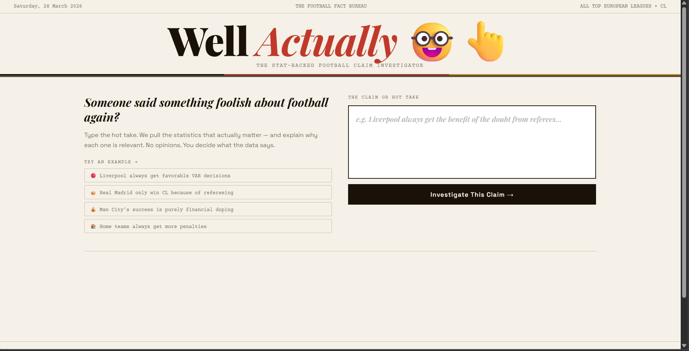

# Well Actually 🤓👆

> *Type any football hot take. Get the stats that actually matter. No opinions — you decide.*

---

Someone says Liverpool always get favourable VAR decisions. Someone says Salah is the greatest Premier League winger ever. Someone says Real Madrid only win the Champions League because of the referees.

**Well Actually** fact-checks football claims using live web search and AI. It pulls 6 real statistics relevant to the claim — stats that both support and contradict it — explains why each one matters, and gives a verdict. No generated opinions, no bias. Just data.



---

## How It Works

1. You type a football claim or hot take
2. The server plans targeted search queries based on the claim
3. **Tavily** searches the live web and returns real, current statistics
4. **Groq (Llama 3.3 70B)** formats the results into 6 stat cards with context and peer comparisons
5. A verdict is returned — rating, credibility score, and a Reddit-style roast

The app deliberately shows stats on **both sides** of the argument. If the claim is wrong, the data exposes it.

---

## Stack

| Layer | Tech |
|-------|------|
| Frontend | HTML, CSS, Vanilla JavaScript (single file) |
| Backend | Python 3, Flask |
| Web Search | Tavily API (free tier — 1,000 searches/month) |
| AI / LLM | Groq API — llama-3.3-70b-versatile (free tier) |
| PDF Export | jsPDF |

---

## Features

- **Live web search** — stats pulled from the real web, not model training memory
- **6 stat cards** per claim, each with a bar chart comparing the subject to peers
- **Supports / Contradicts / Context** badge on every stat
- **Verdict system** — 10 Reddit-style ratings (Certified Banger, Cope, Ratio'd By Stats, etc.)
- **Animated credibility score gauge** — 0 to 100 arc meter
- **Roast** — one savage line reacting to the claim
- **PDF report download** — shareable formatted report of the full investigation
- Covers Premier League, La Liga, Bundesliga, Serie A, Ligue 1, Champions League

---

## Setup

### Prerequisites
- Python 3 installed
- A free [Groq API key](https://console.groq.com) — no credit card
- A free [Tavily API key](https://tavily.com) — no credit card, 1,000 searches/month

### Install dependencies

```bash
pip install flask flask-cors requests
```

### Add your API keys

Open `server.py` and replace the placeholders at the top:

```python
GROQ_API_KEY = "your-groq-key-here"
TAVILY_API_KEY = "your-tavily-key-here"
```

### Run

```bash
python server.py
```

Then open **http://localhost:5050** in your browser.

---

## Example Claims to Try

- *"Erling Haaland is the most unstoppable striker in Premier League history"*
- *"Liverpool always get favourable VAR decisions"*
- *"Real Madrid only win the Champions League because of the referees"*
- *"Mo Salah is the starting right winger in the all-time Premier League XI"*
- *"Man City's success is purely financial doping"*

---

## Project Background

Built as a portfolio project in a day. The idea came from being a Liverpool fan and getting tired of friends making confident football claims with zero data to back them up. Rather than arguing back with vibes, I wanted something that could pull the actual numbers — and be honest enough to prove me wrong too when the data says so.

---

## License

MIT — free to use, modify, and build on.
